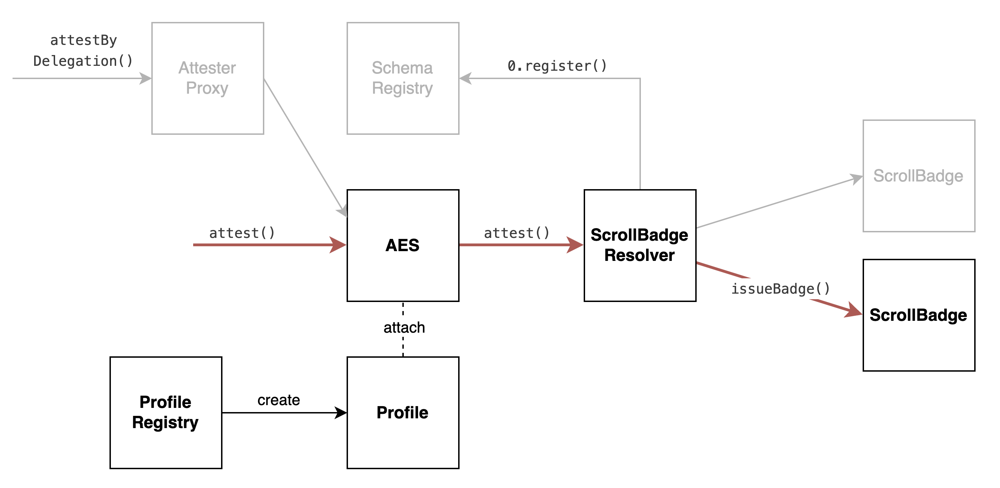

# Scroll Canvas Contracts



([Editable link](https://viewer.diagrams.net/?tags=%7B%7D&highlight=0000ff&edit=_blank&layers=1&nav=1&title=skelly-v4.drawio#R7VpLc6M4EP41rpo5xIWEMeYYx8nsIdma2Rx2clRABs0K5BVybO%2BvXwkknk7ijCEwNalUyqjVenV%2F%2FVDDxL6K91842kR3LMB0Aq1gP7FXEwgBsIH8UZRDTllY85wQchJoppJwT%2F7Dmmhp6pYEOK0xCsaoIJs60WdJgn1RoyHO2a7Otma0vuoGhbhFuPcRbVP%2FJoGI9Ckcq6T%2FgUkYmZWBpXtiZJg1IY1QwHYVkn09sa84YyJ%2FivdXmCrhGbnk426e6S02xnEiThkQf%2Ft2uwvggibu7Q9%2Fk1hfCbzQykjFwRwYB%2FL8usm4iFjIEkSvS%2BqSs20SYDWrJVslzy1jG0kEkvgDC3HQykRbwSQpEjHVvXLD%2FPBdj88aD6oxdUxzta92rg66lQrO%2FinUIAW4XBNKrxhlPNu7vV742PcLzkrP48KZOWqOttS0IFO25T5%2BQVQGfYiHWLzAZ%2Bd8So6VBbROvmAWY3kmycAxRYI81XGGNFzDgq%2FUqHzQSn2DgsEsn%2FgJ0a1eagLnVB5gGZCnmurn%2F24VFpd%2BLrZLtcfw8ZPjTaBc2yp%2FP2dylLaUiIs1igk95Nx3OKEsZ7qTgPD1s5wZxRIZSz3%2FlZQ0wVz2%2FIl3zc58SMwSlm6Q0kexUprBSa0DrM0%2B76AkwReRtr%2Bsy9Fd82K%2Beah%2BkRA4FZ8%2Bm8NLYWbnz3uPWsEtepTOrIZcREmYyGdfokeewF4%2BYS6I9BaXuiMmQZAbCZb7RY%2FZfAp3G0YSkSnXWU6clcKuPJQxNKsNy5fMVa2K95Mj%2Fk%2BvWHMxNdTpURfW1Fo4bj72UJvpZFzqyb%2Bqk5WzXHj1EWy9TqW9NHFcbOkMaLeQfX1539LkLiIC3%2BdYWu1kkGpoNN3kYWNN9sqn1dRyxMeCZzTwrKTthVWTsu3q9q4STjQpqkQSQ%2BvcI8CW2O79CMfIWMYjN1bxFw5JapY8R6Ytd7zM%2FrS0j9F7EDx0Bha8O2isLRqnxVq8J%2BJ7ySlbD5WecpBq1OPzm9T5atS1T4y6cFRR12uperCkqR5mOrXFzpQ3G5XyzNVjDNobNuU9VX%2FOqPRnHwlwnFG6RGp%2FR6JcyuiTykdHljk4zsgyh%2FZVoibYDsXXsaM6XeZuU%2BZwYJk77ybzLiDbFN9saPEB%2BJv48ld9NOjaRzeufxoB0G0gADRUmwcdPaqHS2Hb%2B3%2FUO37Zeocx304KHrAGTN06E%2B5FsmiqH4v6DD1WPxYfQFe%2F1pRnZQrMxwT202Ppm5Hs2I26Rn%2BVonbForfgCU8tSIBqOaIoTrxfQQLOhwq4512KwFEz6L36FFyql3CymbAE55QborauFYS4MBw%2BRWlKfEPWbKBnPfadEIFZw1y9hrnmQGolRFIq6FBh0z7mzevc%2FBy%2FfMh30GnQMkKvBK3LLFFRUaN5Mf%2FK2f782vMorpWwKeyha9HwI3vIMEbSdIuzu%2FSYsodXUuXOUom5Z00tS6JzMfechV2%2FuM1U38yZyX%2FHdW3YV2CyPpBYXtiWh7YfXGGKQxmCWDImjPYIS5DBEngAQMe1JDgXdec596ae58zmnu1CD3p9AXPgb2PKetJDte%2B59PiVTCtAaZTtC5yVNRk38Ktlv27LyUh7Q340Dst5EX%2Fn25M1BZb51uNns9n%2BCxoGWhUdyQxwTej4ytzNTwtm3sDpnH3sK68hndfkTZXxM%2FzRqa8oDbpedUhlvdC27XpKZGp9I7ah9usin2Mk2iY0Ij9nsNtFjRdA68zCrinkNt9b9Ki09iuLwvH19klW1y4RgndzibJZfjWdK6H89ty%2B%2Fh8%3D))

## ScrollBadge Schema and Resolver

We define a *Scroll badge* [EAS schema](https://docs.attest.sh/docs/core--concepts/schemas):

```
address badge
bytes   payload
```

This schema is tied to `ScrollBadgeResolver`.
Every time a Scroll badge attestation is created or revoked, `ScrollBadgeResolver` executes some checks.
After that, it forwards the call to the actual badge implementation.

## Profiles

Each user can create a `Profile` contract, minted through the `ProfileRegistry` contract.
Each wallet can mint only one profile.
All profiles share the same implementation, upgradable by Scroll to enable new features.

The main use of profiles is personalization.
Users can configure a username and an avatar.
Users can also decide which badges they atach to their profile, and in which order.

## Badges

Each badge is an EAS attestation that goes through the `ScrollBadgeResolver` contract and a badge contract.

Each badge type is a standalone contract, inheriting from `ScrollBadge`.
This badge contract can implement arbitrary logic attached to the attestation.
Badges implement a `badgeTokenURI` interface, similar to `ERC721.tokenURI`.

Badges are minted to the user's wallet address.
The user can express their personalization preferences (attach and order badges, choose a profile photo) through their `Profile`.

See [badges](./docs/badges.md) for details.

### Extensions

This repo contains some useful [extensions](src/badge/extensions):
- `ScrollBadgeAccessControl` restricts who can create and revoke this badge.
- `ScrollBadgeCustomPayload` adds custom payload support to the badge.
- `ScrollBadgeDefaultURI` sets a default badge token URI.
- `ScrollBadgeEligibilityCheck` adds a standard on-chain eligibility check interface.
- `ScrollBadgeNoExpiry` disables expiration for the badge.
- `ScrollBadgeNonRevocable` disables revocation for the badge.
- `ScrollBadgeSBT` attaches an SBT token to each badge attestation.
- `ScrollBadgeSelfAttest` ensures that only the recipient of the badge can create the badge.
- `ScrollBadgeSingleton` ensures that each user can only have at most one of the badge.

### Examples

This repo also contains some [examples](src/badge/examples):
- `ScrollBadgeSimple` is a simple badge with fixed metadata.
- `ScrollBadgePermissionless` is a permissionless badge that anyone can mint to themselves.
- `ScrollBadgeLevels` is an SBT badge that stores a level in its payload and renders different images based on this level.
- `ScrollBadgeTokenOwner` is a badge that is tied to the ownership of a Scroll Origins NFT.
